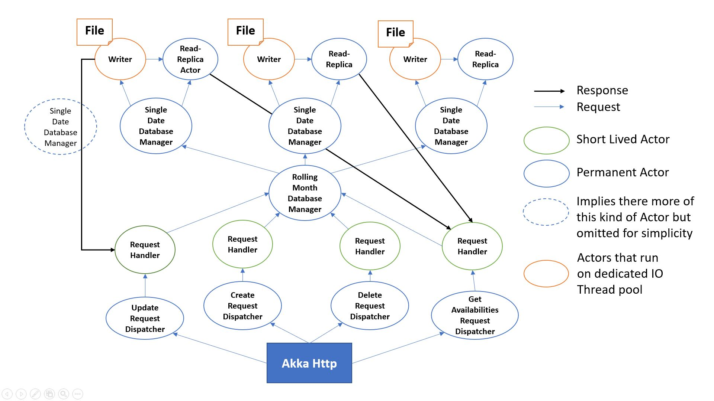
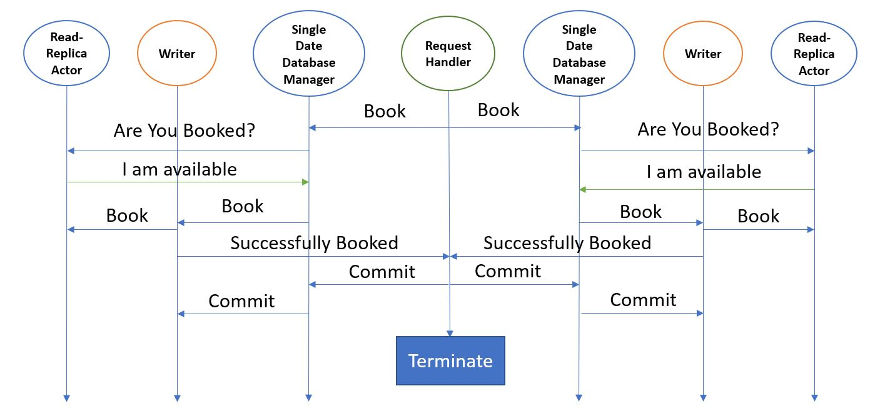

# Volcano Island Challenge 
A solution by Bassam Riman.
## 1. Requirements
### Functional Requirements
Here are the **functional requirements** as gathered from the problem statement:
1. There is only **1 campsite**.
2. The campsite can be reserved for **max 3 days**.
3. The campsite can be reserved **minimum 1 day ahead of arrival**.
4. The campsite can be reserved **up to 1 month in advance**.
5. Reservations can be cancelled anytime.
6. Check-in & check-out time is 12:00AM.
7. User should be able check the campsite availability (default 1 month).
8. User should be able to reserve by providing his **email** and **full name** along with **arrival date** and **departure date**. 
9. User should receive a booking identifier if the reservation is successful.
10. Users can **cancel** the booking using the booking identifier they received.
11. Users can **update** the booking using the booking identifier they received.
### Non-Functional Requirements
Here are the **non-functional requirements** as gathered from the problem statement:
1. Multiple users booking the same/or overlapping date(s) should be handled gracefully.
2. Handle large volume of request to get campsite availability.
3. No restriction on how reservations are stored.
### Requirement Clarification
#### 1. Clarification of Functional Requirement #1
This implies that this resource (the campsite) will be contested. Hence, concurrent request for booking will happen very often.
#### 2. Clarification of Functional Requirement #2, #3 and #4
This implies when need to return errors to the user informing them with what is wrong with their request. Ideally, multiple errors as they are not mutually exclusive given the user will be providing a range of dates.
#### 3. Clarification of Functional Requirement #6
This implies that bookings are in chunks of 1 day. Combined with functional requirement #1 (There is only **1 campsite**), we can conclude that a day at the campsite is a contested resource (not the campsite itself as concluded from the first requirement clarification). Given functional requirement #4 (can be reserved **up to 1 month in advance**), we will have 30 contested days! We can use that to our advantage to optimize writes (more on that later).
#### 4. Clarification of Functional Requirement #7, #8 and $11
Since the user will be providing a date range, we need to validate that it's a correct date range (end date/departure date is not before start date/arrival date).


## 2. System Interface (REST API)
Here we define system interface provided to the users.
#### Endpoints
##### Bookings Endpoint
Path: http://localhost:8080/bookings
###### POST with Json Payload (Create Booking)
Payload:
```
{
    "fullName":"Bassam Riman", 
    "email":"bassam.riman@gmail.com,
    "arrivalDate": "12/02/2020",
    "departureDate": "12/02/2020"
}
```
Possible Errors:
1. Departure date before Arrival date.
2. Date already booked.
3. Date already occurred.
4. Date can only be minimum 1 day ahead of arrival.
5. Date can only be up to 1 month in advance.
6. You can only book 3 days
###### POST with Id and Json Payload (Update Booking)
Append booking confirmation at end of path. 

Example: http://localhost:8080/bookings/your-confirmation-id


Payload:
```
{
    "fullName":"Bassam Riman", 
    "email":"bassam.riman@gmail.com,
    "arrivalDate": "12/02/2020",
    "departureDate": "12/02/2020"
}
```
Possible Errors:
1. Booking not found
2. Departure date before Arrival date.
3. Date already booked.
4. Date already occurred.
5. Date can only be minimum 1 day ahead of arrival.
6. Date can only be up to 1 month in advance.
6. You can only book 3 days

 
###### DELETE with Id (Cancel Booking)
Append booking confirmation at end of path. Example:
 
 http://localhost:8080/bookings/your-confirmation-id


Possible Errors:
1. Booking not found

 
##### Availabilities Endpoint
Path: http://localhost:8080/availabilities


 
###### GET with Json Payload (get availabilities)
Payload:
```
{
    "startDate": "12/02/2020",
    "endDate": "12/02/2020"
}
```
Possible Errors:
1. End date before Arrival date.

 
###### GET (get availabilities default to 1 month)
No id and no payload.

## 3. Defining data model
### Initial Data Model Design
Our booking data model will be defined with the following data:
```
  String id                #System generated
  String email             #Provided by user
  String fullName          #Provided by user
  LocalDate arrivalDate    #Provided by user
  LocalDate departureDate  #Provided by user
```
We can store this in a table or any database (since it ain't relational). 
We would then be able to query for bookings by using the arrival date and departure date fields.


However, a booking request would have to do two requests to the database: 
one to query the for latest version of the table (to check that the requested dates are available) and another to persist the booking should it pass validation.
Not to mention, all writes will be competing for the same table. 
Is there a better way to optimise for writes and simplify things?
 
### Optimizing writes
A user reserving a date at the campsite shouldn't have to wait after a user reserving for another date. 
Taking advantage of the fact days at the campsite are the contested resource (Requirement clarification #3), we can achieve better writes.
#### Splitting our table
To solve this, we can create a table for each day that holds, in order of occurrence, the history of booking events for that day. This is feasible because
there is only 365 days a year, and we don't expect many people to cancel or update their booking as the island will be in high demand. Which implies that the amount of data is predictable and would be under control. 


Moreover, there is only ~30 days a month (amount of days the user can reserve given certain day), hence only 30 tables would be active at a time. When the date rolls (cross midnight) we can archive the first reservable date and setup a new table for the new last reservable date. 
It would behave like a moving window like shown below:


As our database gets large we can simply archive old tables. Whereas with the initial approach we would have to run a booking clean-up query by date.


However there is another issue, if each date database held the history of booking events that happened during the day, 
we would still need to hold references to the booking table (in a normalized database). Like shown below:
```
#EVENT HISTORY
NoBookingEvent                 # The day start with no booking
BookedEvent(bookingReference)  # New booking comes in
NoBookingEvent                 # booking gets cancelled
BookedEvent(bookingReference)  # New booking comes in
```
Could we get away with denormalizing the database?
#### Denormalizing our database
Denormalizing (replacing reference by duplicate) the database would help remove the booking table all together, and the need for a relation between the date tables and the booking table.
In other words, a date table would hold all the information we need by replacing booking references with full booking information. It would then look like shown below:
```
#EVENT HISTORY
NoBookingEvent                                                         # The day start with no booking
BookedEvent(Booking(id, email, fullname, arrivalDate, departureDate))  # New booking comes in
NoBookingEvent                                                         # booking gets cancelled
BookedEvent(Booking(id, email, fullname, arrivalDate, departureDate))  # New booking comes in
```

Can we get away with that? What are the pros and cons of denormalizing the database?
##### Pros of denormalizing our database
- No need to hold a global booking table.
- We eliminate the need for date tables to reference the booking table.
- Replace Relation Database by Append-only database (extremely fast writes).
- Completely shard database per day. 
##### Cons of denormalizing our database
- We will have duplicate booking entries for 3 day bookings. However, this is not so bad as bookings are at most 3 days. Not to mention, easy to find since the days booked are contiguous. 
- For multi day bookings, we will have to synchronize between at most 3 date database (or more in case of update). This is manageable as we will see later.
#### Append-only date database fits our requirement very well
Append-only database is a database that appends data at the end of a file. It is the fastest way to write to a disk.


In our use case, each day will have its own file. We will be appending the latest booking events (in a serialized fashion) to that file.

Like the following:
```
#EVENT HISTORY
NoBookingEvent                                                         # The day start with no booking
BookedEvent(Booking(id, email, fullname, arrivalDate, departureDate))  # New booking comes in
NoBookingEvent                                                         # New booking gets cancelled
BookedEvent(Booking(id, email, fullname, arrivalDate, departureDate))  # New booking comes in
```
Retrieving the latest state of booking for a given date would just come down to skip to the end of the file and deserialize the last event.
Even better, the skipping can be done at boot time of the database. While up, the database can hold a reference to the end of file in memory for extremely fast writes with no seek.

##### How does Append-only date database fit our requirements?
###### Creating a booking 
Creating a booking will come down to forwarding the booking request to right date databases. 
Since a booking request holds the dates, we know exactly which database to contact. The forwarding happens in asynchronous fashion. 
If the date of the date database is not booked, the date database will append the new booking event to its file (fast write).

###### Deleting a booking 
Deleting a booking will come down to broadcasting the booking cancellation request, in asynchronous fashion, to all date databases. 
The cancellation request holds a booking id which, at the date database level, can compared the latest booking id. 
If it matches, a NoBookingEvent will be appended to its file (fast write). 
If none got deleted then we can conclude that booking id doesn't exist.

###### Updating a booking 
Updating a booking will come down to broadcasting (in asynchronous fashion ), to all date database, the booking update request (because we don't know the dates of the previous version of the booking).
Handling of an update request at the date database level is a bit more complex. The date database handling of an update request is shown in the table below:

###### Getting availabilities
Get availabilities comes down to broadcasting a get availability request to the 30 date databases and aggregating the responses. This is super fast as the date database caches the latest booking in memory without need to read from file.
#### Summary
Our database will consist of an append-only file per date. Which will hold events, in the order of occurrence, with the corresponding booking.


This design allows for up to 30 concurrent extremely fast writes and reads at the same time.

## 4. High-level design
We will pick actor concurrency model to implement our design. 
The Actor concurrency model is a message passing concurrency model. 
It supports asynchronous communication natively and supports no shared mutable state.
An actor is effectively a method that handles java objects of certain type (which we call messages) along with a blocking queue (which we call mailbox) that holds those messages. 
When we need to communicate with an actor, the message gets inserted in the blocking queue (mailbox), then a thread (which we is called dispatcher) will detect the message and schedule the associated method to run, with that msg as input, on a thread pool.
An actor can also change its behavior (state) by overriding the previous method with a new one.
One important property of Actors is that it handles messages in the order they arrive.


The below diagram represents a high-level overview of the actors in our system, and the way they communicate:

#### Request Dispatcher actor
The request dispatcher actor will create a Request Handler Actor for each request.
#### Request Handler Actor
There are 4 types of request handlers actor: createBooking, updateBooking, deleteBooking, getAvailabilites.
Each one of these actors handles uniquely there corresponding request type.


Overall, a request handler actor will send requests dedicated for each date database and collect all the response then make a decision.


There is one request handlers actor per request from user. 
#### **Rolling Month** Database Manager Actor
The rolling month database manager actor supervises the single date databases and act as a router that forwards messages to the intended data database actor.
It's also the single point of truth of the current date (acts like clock). 
On date roll (when we cross midnight) this actor will kill the earliest date database and spawn a new for the new date.


Disclaimer: the date rolling feature is not implemented in this app due to time constraint. 
However, one can achieve the same goal simply by restarting the app at midnight (as we query the current date at boot time and act accordingly). 
#### Single Date Database **Manager** Actor
The single date database manager actor supervises and forward messages to the writer actor and the read-replica actor.
When the single date database manager actor receives a read message, it gets forwarded to the read-replica to reduce load on the writer as the writer runs on dedicated IO thread pool.
When it receives a write message it queries the read-replica first to check if the date is booked. 
If so, there is no point of forwarding the message to the writer actor.


This actor represents a single date database. There are 30 of these in total.
#### Single Date Database **Writer** Actor
The writer actor is responsible to persisting (by appending) bookings to end of its dedicated file. 
It also holds the last state in memory so that it doesn't have to load it every time. 
It's also responsible for replicating its state to the Read-replica actor. 
This actor runs on a dedicated IO thead pool.


There is one writer per single date database manager actor. Each writer will have its own file to write to, named after the date it's handling. 
If the file doesn't exit, it will create it. 

#### Single Date Database **Read-Replica** Actor
The read-replica is a mirror of the writer actor but stripped from it's writing capabilities. 
It acts like a cache to eliminate read load from the writer actor. 
When an actor is busy it can't process more messages. The writer actor is expected to remain busy doing expensive IO.
In addition, read requests are more frequent than write request. Hence, we need the read-replica to serve the reads.


There is one read-replica per single date database manager actor.
## 4. Low-level design
### Using transactional operation to maintain consistency for bookings that span across multiple dates
When we receive a request to book 3 available days, the request handler will send (in asynchronous fashion) a booking message to the 3 corresponding single date databases.
Each single date database will **not** persist the booking right away, instead they will enter a transactional state where each is expecting either a commit or revert command.
The request handler will collect the feedback responses from all 3 single date databases.
If all responses are success', the request handler will request the databases to commit. Hence, write to disk. 
In the case where a day out of the 3 days is booked, the request handler will request the databases to revert.
The databases will then revert to previous state while discarding current request.


In transactional state, the single date databases will behave as always booked to prevent other users from booking the date.
In other words, if the date was previously booked then the booking got cancelled (due to an update), the date will remain booked to the external world until we receive a commit message.


The timing diagram below shows the correspondence between each actor involved in a successful booking (the rolling month database actor was omitted as it is simply a forwarder):





If the date was not previously booked then got booked, the date will become booked to eyes of the external word until reverted. The read-replica actor will be informed accordingly.


The timing diagram below shows the correspondence between each actor involved in a failed booking update (the rolling month database actor was omitted as it is simply a forwarder):


### Handling errors
Handling errors in our REST API is done at multiple level in the app to allow for better performance and provide more information to the users.
#### End/Departure date is before Start/Arrival date error
This error handled very early before creating the request handler as the request fundamentally invalid. 
#### Max allowed days per booking
This error handled very early before creating the request handler.
#### Out of Range Errors
The out of range errors, which are time related, are the following:
1. Date already occurred.
2. Date can only be minimum 1 day ahead of arrival.
3. Date can only be up to 1 month in advance.

These errors are detected at rolling month database manager actor level as it's the only one aware of time and knows that the single date database doesn't exist for the given date.
The feedback will be collected by the request handler which will be sent to user in a form of an error.


These errors are returned in a list errors as each date can have its own error associated with it.  
#### Booking not found error
This is detected at the request handler level after it collected all the responses from update or delete requests.
The request handler will check if an existing booking was affected and act accordingly. 
#### Date already booked error
This error is detected at the read-replica date database actor and also returned in a list of errors as each date can have its own error associated with it.  
## 5. Running the app
Simply run the main method. 
### Unit tests
There are functional unit tests covering all the functional requirements. These, are high level tests that acts as a user submitting HTTP requests. 
In addition, there are non-functional unit test covering non-functional requirements (like concurrency).

## Summary
This design allowed us to achieve high write and read throughput and fast writes. It's a solution very specialized for this use case. 
However, in the real world we would have more complicated requirements that would require us to use mainstream databases.


Overall, it was a very fun challenge. If you made it this far reading this readMe then I would like to thank you for your time, and I hope it wasn't boring.
 
 
Looking forward for your feedback.

